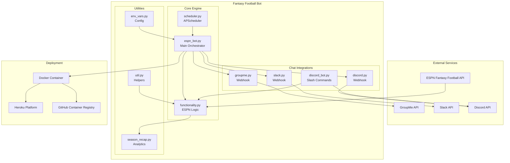
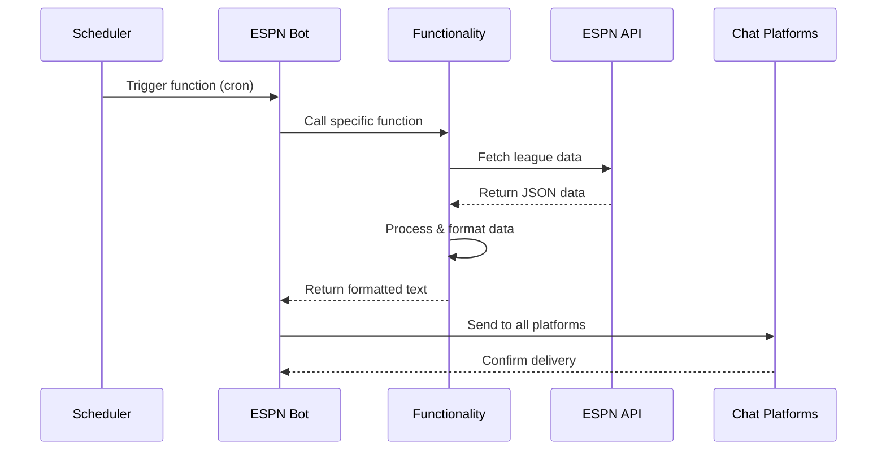
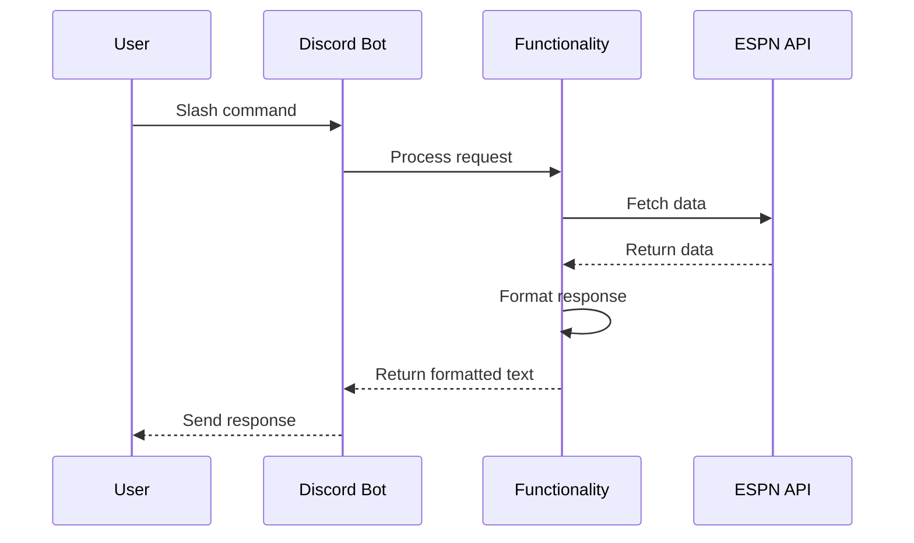

# Fantasy Football Chat Bot - Architecture

## 🏗️ System Architecture

### High-Level Architecture



## 🔧 Component Architecture

### 1. Core Engine (`gamedaybot/espn/`)

#### **espn_bot.py** - Main Orchestrator
- **Purpose**: Central coordinator for all bot operations
- **Responsibilities**:
  - Initialize ESPN league connection
  - Configure chat platform integrations
  - Route function calls to appropriate handlers
  - Manage environment configuration
  - Handle Discord bot lifecycle

**Key Functions**:
```python
def espn_bot(function: str) -> None:
    """Main entry point for bot operations"""
    # Load configuration
    # Initialize ESPN league
    # Create chat platform instances  
    # Execute requested function
    # Send messages to all platforms
```

#### **functionality.py** - ESPN Data Processing
- **Purpose**: Core business logic for ESPN Fantasy Football data
- **Responsibilities**:
  - Fetch and process ESPN league data
  - Calculate advanced statistics and analytics
  - Format data for chat platform consumption
  - Handle all scoring, standings, and player analysis

**Key Function Categories**:
- **Scoreboards**: `get_scoreboard_short()`, `get_projected_scoreboard()`
- **Standings**: `get_standings()`, `top_half_wins()`
- **Analytics**: `get_power_rankings()`, `optimal_team_scores()`
- **Reports**: `get_monitor()`, `get_waiver_report()`, `get_trophies()`
- **Matchups**: `get_matchups()`, `get_close_scores()`

#### **scheduler.py** - Automated Scheduling
- **Purpose**: Manage cron-based automated messaging
- **Technology**: APScheduler with timezone support
- **Schedule Pattern**:
  ```python
  # Example scheduling pattern
  sched.add_job(espn_bot, 'cron', ['get_scoreboard_short'], 
                day_of_week='sun', hour='16,20', 
                timezone='America/New_York')
  ```

**Schedule Overview**:
- **Monday**: Close scores (6:30 PM ET), Scoreboard (7:30 AM local)
- **Tuesday**: Final scores & trophies (9:45 AM), Power rankings (6:30 PM)
- **Wednesday**: Standings (7:30 AM), Waiver report (7:31 AM)
- **Thursday**: Matchups (7:30 PM ET)
- **Friday**: Scoreboard (7:30 AM local)
- **Sunday**: Player monitor (7:30 AM), Scoreboard (4:00 PM, 8:00 PM ET)

### 2. Chat Platform Integration (`gamedaybot/chat/`)

#### **Webhook Pattern** (GroupMe, Slack, Discord)
```python
class ChatPlatform:
    def __init__(self, webhook_url: str):
        self.webhook_url = webhook_url
    
    def send_message(self, text: str) -> requests.Response:
        # Platform-specific message formatting
        # HTTP POST to webhook URL
        # Error handling and logging
```

#### **Discord Bot Integration** (`discord_bot.py`)
- **Purpose**: Interactive slash commands for Discord
- **Technology**: discord.py with application commands
- **Architecture**: Cog-based command organization

```python
class FantasyFootballCog(commands.Cog):
    @app_commands.command(description="Get current scores")
    async def current_scores(self, interaction):
        # Direct ESPN API calls
        # Real-time data processing
        # Formatted response
```

### 3. Data Flow Architecture

#### **Scheduled Message Flow**


#### **Interactive Command Flow**


## 🎯 Design Patterns & Principles

### 1. **Strategy Pattern** - Chat Platform Abstraction
```python
# Common interface for all chat platforms
class ChatPlatform:
    def send_message(self, text: str): pass

# Concrete implementations
class GroupMe(ChatPlatform): ...
class Slack(ChatPlatform): ...  
class Discord(ChatPlatform): ...
```

### 2. **Template Method Pattern** - Message Processing
```python
def process_espn_data(league, function_name):
    # 1. Fetch data from ESPN
    # 2. Apply business logic
    # 3. Format for display
    # 4. Return standardized output
```

### 3. **Factory Pattern** - Configuration-based Initialization
```python
def create_league(league_id, year, espn_s2=None, swid=None):
    if espn_s2 and swid:
        return League(league_id=league_id, year=year, 
                     espn_s2=espn_s2, swid=swid)  # Private league
    else:
        return League(league_id=league_id, year=year)  # Public league
```

### 4. **Observer Pattern** - Multi-Platform Broadcasting
```python
def broadcast_message(text):
    platforms = [groupme_bot, slack_bot, discord_webhook]
    for platform in platforms:
        if platform.is_configured():
            platform.send_message(text)
```

## 📊 Data Models & Processing

### ESPN API Data Models
- **League**: Core league information and settings
- **Team**: Team data, records, and roster information  
- **BoxScore**: Weekly matchup data with scores and projections
- **Player**: Individual player stats, status, and projections
- **Activity**: Transaction history (adds, drops, trades)

### Data Processing Patterns

#### **Scoring Calculations**
```python
def get_scoreboard_short(league, week=None):
    box_scores = league.box_scores(week=week)
    # Format: 'TEAM 123.45 - 67.89 TEAM'
    score = ['%4s %6.2f - %6.2f %s' % (
        i.home_team.team_abbrev, i.home_score,
        i.away_score, i.away_team.team_abbrev
    ) for i in box_scores if i.away_team]
    return '\n'.join(['Score Update'] + score)
```

#### **Advanced Analytics**
```python
def optimal_lineup_score(lineup, starter_counts):
    # 1. Categorize players by position
    # 2. Sort by points scored
    # 3. Select optimal starters
    # 4. Handle flex positions
    # 5. Calculate efficiency percentage
```

## 🔐 Security & Configuration

### Environment Variable Management
```python
# env_vars.py pattern
def get_env_vars():
    return {
        'league_id': os.environ.get('LEAGUE_ID'),
        'bot_id': os.environ.get('BOT_ID', '1'),  # Default fallback
        'espn_s2': os.environ.get('ESPN_S2', '1'),
        # ... other variables with validation
    }
```

### Private League Authentication
- **ESPN_S2**: Session cookie for authenticated requests
- **SWID**: ESPN user identifier
- **Security**: Credentials stored as environment variables

## 🚀 Deployment Architecture

### Docker Containerization
```dockerfile
# Multi-stage build
FROM python:3.x-slim as builder
# Install dependencies
FROM python:3.x-slim as runtime  
# Copy application and run
```

### Heroku Platform Integration
- **Procfile**: Defines worker process
- **app.json**: One-click deployment configuration
- **Environment**: Managed via Heroku config vars
- **Scaling**: Single dyno sufficient for most leagues

### GitHub Actions CI/CD
```yaml
# Automated workflow
- Build Docker image
- Run tests  
- Push to GitHub Container Registry
- Deploy to Heroku (optional)
```

## 🔧 Error Handling & Resilience

### Exception Handling Patterns
```python
try:
    league_data = espn_api_call()
except ESPNException as e:
    logger.error(f"ESPN API error: {e}")
    return "ESPN service temporarily unavailable"
except Exception as e:
    logger.error(f"Unexpected error: {e}")
    return "An error occurred"
```

### Graceful Degradation
- Missing chat platform credentials → Skip that platform
- ESPN API failures → Return error message
- Scheduler issues → Log and continue with next job
- Invalid league data → Provide fallback content

## 📈 Performance Considerations

### API Rate Limiting
- ESPN API: Reasonable request patterns
- Chat Platforms: Message rate limits respected
- Caching: None implemented (real-time data preferred)

### Resource Usage
- Memory: Minimal (stateless operations)
- CPU: Light processing of JSON data
- Network: Outbound HTTP requests only
- Storage: No persistent storage required

## 🔄 Extension Points

### Adding New Chat Platforms
1. Create new class implementing chat interface
2. Add environment variable configuration
3. Initialize in `espn_bot.py`
4. Add to broadcast list

### Adding New ESPN Functions
1. Add function to `functionality.py`
2. Add case in `espn_bot.py` function router
3. Optionally add to scheduler
4. Add Discord slash command if desired

### Adding New Analytics
1. Extend `functionality.py` with calculation logic
2. Add to appropriate message templates
3. Consider adding to season recap functionality

This architecture provides a solid foundation for understanding, maintaining, and extending the fantasy football chat bot system.